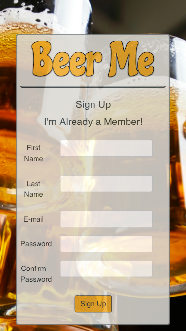
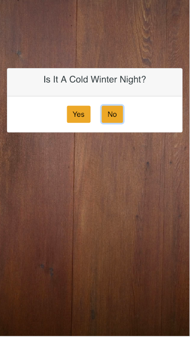
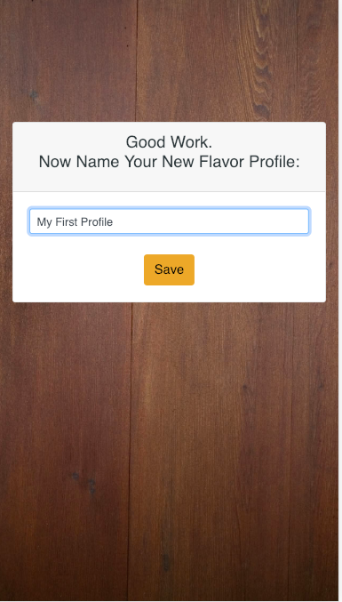
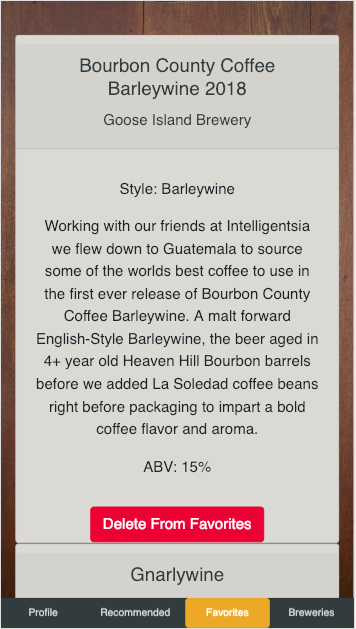

# BeerMe Chicago

- **For:** Northwestern Coding Bootcamp
- **Developers:** Benjamin Delong, Kat Eng, Kayla Verheyen, Sergio Ontiveros
- **Deployment Date** 
- **Built With**  HTML, CSS, Animate CSS, Boostrap, Javascript,  Node.js, Express, mySQL, Sequelize, PassportJS  
- **APIs** Google Maps

---

## Description & Requirements

**Introducing you to Chicago Breweries & Beers!**

1. Sign in or sign up and create a user profile

2. Take a quiz and get recommendations and descriptions about local breweries and beers

3. Save your recommended profiles full of beer based off your mood or palate

4. Or be more selective and only choose your favorites

### Notes
---
Working with sequelize proved difficult due to limited documentation, but it did save work where it could be applied.

In the future we hope to added the following capabilitites:

1. Add Friends
2. Compare Favorites
3. Find local bars that serve your favorite beers
4. Beer Rating
5. Beer Reviews