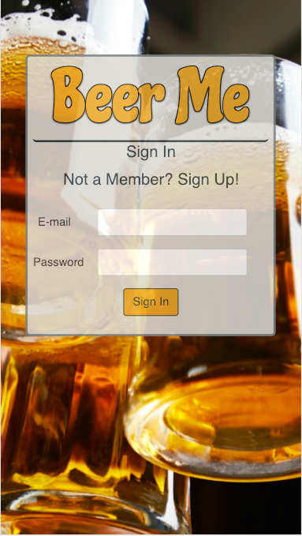

# BeerMe
---
- **For:** Northwestern Coding Bootcamp
- **Developers:** Benjamin Delong, Kat Eng, Kayla Verheyen, Sergio Ontiveros
- **Deployment Date** 
- **Built With**  HTML, CSS, Boostrap, Javascript, Handlebars, Node.js, Express, mySQL2, Sequelize, Passport  
- **APIs** Google Maps, BreweryDB

---

## Description & Requirements

**Introducing you to Chicago Breweries & Beers**

1. Sign in or sign up and create a user profile

2. Take a quiz and get recommendations from local breweries

3. Save favorites 

### Notes
---
